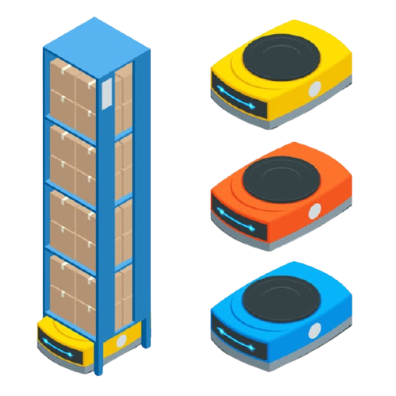
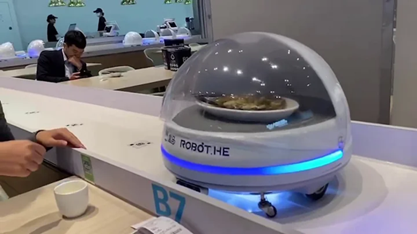
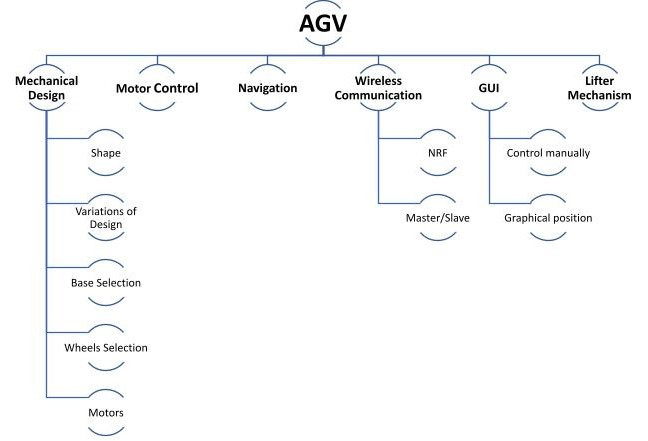

  

<h1 align="center">AGV</h1>

       

  

---
## What is AGV
AGV stands for Auto Guided Vehicle which moves without guidance from humans and can be used in many applications.
Check this [wiki ](https://en.wikipedia.org/wiki/Automated_guided_vehicle) for more details.

---
## Applications
Our objectives is to manufacture an AGV to help in the following:
### Warehouses
AGV can be used for warehouses logistic to:
* Get packages organized inside the warehouse.
* Delivering a package from the warehouse to a human ordered it from a GUI (i.e., Amazon store orders packaging).

  
**[Watch Full Video](https://www.youtube.com/watch?v=WzjzoJTkRmo)**

### Hospitals
* **Food**: Deliver food from the kitchen to patients' rooms.
* [Medicine](https://www.youtube.com/watch?v=vlOY9p3ASqo): Deliver medicine from the pharmacy to patients' rooms.
  
### Restaurants
Deliver food to customers.

  
**[Watch Full Video](https://www.youtube.com/watch?v=FFCPKmLAZb4)**

---
## Technical progress
The project consists of:

  
Team is divided into:

### SOFTWARE
SW tools used: [VS Code ](https://www.arduino.cc/en/software) 

Platform used: [Arduino Uno ](https://www.arduino.cc/en/software) 

***Responsibilities***: Responsible for the hidden part of the project.
   * SW design based on Autosar architecture.
   * Bare Metal programming.

***Progress***: can be found in file [SW_Tasks.xlsx](SW/SW_Tasks.xlsx)

***Work***: can be found in folder [SW](SW/)

### MECHANICAL
Go to this [repo]().

### ELECTRICAL
Go to this [repo]().

### GUI
Go to this [repo]().

---
## What is CLR?
### Vision
our vision is to extend our robot to be a network of robots connected together with master devices. And they are responsible for logistics in a place where they are used.
So, CLR stands for Colony of Logistic Robots. As the name suggest, it means a networks of robots responsible for logistics.

### Why CLR instead of AGV? 
We aim to use robots either on the ground (AGVs) or on the air (drones). So, AGV name stands only for grounded robot, that's why we named it CLR to stand for both applications.

---
## Support our efforts!

[Or leave a tip! ヾ(°∇°*)](https://www.paypal.me/kmahmoud633)

---
## Licenses
 All DOCUMENTS inside this work is licensed under a <a rel="license" href="http://creativecommons.org/licenses/by-sa/4.0/">Creative Commons Attribution-ShareAlike 4.0 International License</a>.

All SOURCE codes & BINARIES are licensed under Apache.

  

  

---
## Credits
All credits and sources are listed inside the page and references themselves.
